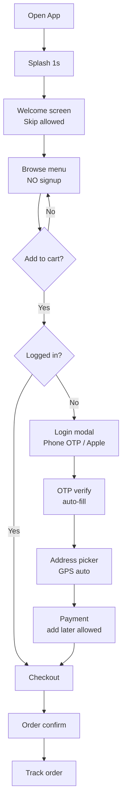

# 🧭 GrabFood Onboarding Redesign — ลด drop-off จาก 35% → 15%

## 📊 Project Brief

| Field | Value |
|-------|-------|
| Product | GrabFood mobile app — first-time user onboarding |
| Phase | Discovery → IA → Flow → Wireframe → Test |
| Platform | iOS + Android (React Native) |
| Business goal | ลด onboarding drop-off จาก 35% → 15% ใน 90 วัน |
| Success metric | Activation rate (first order ใน 7 วัน) ≥ 40% |
| Deadline | 6 สัปดาห์ |

---

## 👤 User Persona

**Primary persona:** น้องอิ๋ว (Iew) — first-time food delivery user

| Field | Value |
|-------|-------|
| Age | 24 |
| Role | พนักงานออฟฟิศ เพิ่งเริ่มทำงาน |
| Tech-savvy | ⭐⭐⭐⭐ (4/5) — ใช้แอปคล่อง แต่ไม่ชอบ form ยาว |
| Goal | สั่งอาหารกลางวันเร็ว ไม่ต้องคิดเยอะ |
| Pain points | กลัวสมัครยาก, กลัวข้อมูลรั่ว, ไม่อยากใส่บัตรเครดิตทันที |
| Behavior | ใช้มือถือ 95%, abandoned 3 แอปแล้วเพราะ onboarding น่าเบื่อ |
| Quote | "ขอแบบกดไม่กี่ที แล้วได้กินเลย" |

---

## 🎯 Jobs-To-Be-Done

> **When** ฉันหิวระหว่างพักเที่ยง,
> **I want to** สั่งอาหารจากแอปใหม่ที่เพิ่งโหลด,
> **so I can** กินได้ภายใน 30 นาที โดยไม่ต้องเสียเวลากรอกข้อมูลเยอะ

**Hypothesis:** เราเชื่อว่า first-time user ต้องการเห็นเมนูก่อนสมัคร เพราะอยากรู้ว่ามีร้านที่ตัวเองชอบไหม เราจะรู้ว่าจริง ถ้า "browse-before-signup" ทำให้ activation เพิ่มขึ้น 25%

---

## 🗂️ Information Architecture

### Sitemap (Onboarding scope)
```
App Launch
├── Splash (1 sec)
├── Welcome (skip-able)
├── Browse Menu (no signup) ← KEY CHANGE
│   ├── Restaurant list
│   └── Restaurant detail
└── Checkout Flow
    ├── Add to cart
    ├── Login OR Signup ← เกิดที่นี่ (ไม่ใช่ตอนเปิดแอป)
    │   ├── Phone OTP (1-tap)
    │   └── Apple/Google sign-in
    ├── Address
    ├── Payment
    └── Confirmation
```

### Navigation pattern
- **Pattern:** Tab bar (4 tabs: Home / Search / Orders / Account)
- **Rationale:** Mobile-first, 4 tabs ตาม Hick's law (เลือกเร็ว)

---

## 🔄 User Flow



**Edge cases:**
- **Empty state (no restaurants in area):** แสดงข้อความ "ยังไม่มีร้านในย่านคุณ — เราจะแจ้งทันทีที่เปิด" + ปุ่ม notify
- **Error (OTP fail 3 ครั้ง):** offer Apple/Google sign-in
- **Loading (slow connection):** skeleton screen, ไม่ใช้ spinner

---

## 📐 Wireframe

### Screen 1: Browse menu (no signup)
```
┌─────────────────────┐
│ 📍 สีลม ▾    [🔍]  │
├─────────────────────┤
│                     │
│ ⚡ ส่งใน 30 นาที    │
│ ─────────────────   │
│ ┌────┐ ┌────┐ ┌──┐ │
│ │ 🍜 │ │ 🍕 │ │🍣│ │
│ │ก๋วย│ │พิซซ่า│ │ซู│ │
│ └────┘ └────┘ └──┘ │
│                     │
│ ⭐ ร้านยอดนิยม      │
│ ┌─────────────────┐ │
│ │ [img] ตำมั่ว    │ │
│ │ ⭐ 4.8 · 25 นาที│ │
│ └─────────────────┘ │
│ ┌─────────────────┐ │
│ │ [img] After You │ │
│ │ ⭐ 4.7 · 30 นาที│ │
│ └─────────────────┘ │
├─────────────────────┤
│ 🏠   🔍   📦   👤  │ ← tab bar
└─────────────────────┘
```

**Spec:**
- Layout: 2-col grid for categories, 1-col for restaurant cards
- Spacing: 16/24/32 tokens
- Typography: Header 18sp, Body 14sp
- Components: LocationPicker, SearchBar, CategoryChip, RestaurantCard, TabBar
- States: empty (no nearby) / loading (skeleton) / default / error (no internet)

### Screen 2: Login modal (triggered at checkout)
```
┌─────────────────────┐
│           ✕         │
│                     │
│   เกือบเสร็จแล้ว!    │
│   ─────────         │
│                     │
│  เบอร์โทรเพื่อยืนยัน │
│  ┌───────────────┐  │
│  │ +66 │ 8X-XXX  │  │
│  └───────────────┘  │
│                     │
│  [ ส่ง OTP    ]    │
│                     │
│  ─── หรือ ───       │
│                     │
│  [🍎 Apple Sign In] │
│  [🔵 Google Sign In]│
│                     │
└─────────────────────┘
```

**Spec:**
- Modal sheet (Apple HIG style — bottom sheet)
- Auto-focus on phone input
- Country code default +66 (detect locale)
- Apple/Google SSO buttons follow brand guideline (44pt height)

---

## 🧪 Prototype Interaction

| Element | Trigger | Animation | Duration |
|---------|---------|-----------|----------|
| Restaurant card | tap | scale 0.97 + haptic light | 100ms ease-out |
| Add to cart | tap | bounce + count badge update | 200ms spring(15) |
| Login modal | trigger | slide-up bottom sheet | 300ms ease-out |
| OTP digit | typing | auto-advance to next field | instant |
| Order confirm | success | confetti + checkmark | 800ms |

**Microinteractions:**
- Skeleton loading on restaurant list
- Pull-to-refresh on home (rubber band iOS / circular Android)
- Haptic on add-to-cart (success feedback)
- Live cart total animation (number tween)

---

## ♿ Accessibility (WCAG 2.1 AA)

- [x] Color contrast ≥ 4.5:1 (text บน image overlay ใช้ scrim 60% black)
- [x] Touch target ≥ 44x44 pt (button + tab bar)
- [x] VoiceOver/TalkBack labels บน restaurant card ("ตำมั่ว, 4.8 ดาว, ส่งใน 25 นาที, แตะเพื่อเปิด")
- [x] Dynamic Type support (iOS) / FontScale (Android)
- [x] Reduce motion alternative (no auto-bounce)

---

## 👥 Usability Test Plan

**Method:** Moderated remote via Zoom + Maze prototype
**Participants:** 8 first-time food delivery users (24-35 ปี, กรุงเทพ)
**Duration:** 30 นาที/session
**Incentive:** Grab voucher 200 บาท

### Tasks
1. "เปิดแอปครั้งแรก ลองดูว่ามีร้านอะไรใกล้ๆ คุณ"
2. "เพิ่มเมนูที่คุณอยากกินเข้าตะกร้า"
3. "ทำการสั่งซื้อให้สำเร็จ (ไม่ต้องจ่ายจริง)"
4. "ลองยกเลิก order"
5. "หา order ที่เพิ่งสั่งไป"

### Success Metrics
| Metric | Target | Current |
|--------|--------|---------|
| Browse-to-cart conversion | ≥ 60% | TBD |
| Signup completion | ≥ 85% | 65% |
| Time-to-first-order (median) | < 4 นาที | 7 นาที |
| SUS score | ≥ 75 | 62 |

### Post-test Questions
- ขั้นไหนรู้สึกยาก / สับสน?
- เทียบกับ Foodpanda / LineMan ดีกว่า/แย่กว่ายังไง?
- จะแนะนำเพื่อนใช้ไหม? (NPS 0-10)

---

## ✅ Deliverable Checklist

- [x] Persona card (1 primary + 2 secondary)
- [x] Sitemap (FigJam)
- [x] User flow Mermaid + FigJam
- [x] Wireframe Figma — 12 screens × 5 states
- [x] Interactive prototype Figma (clickable hotspot)
- [x] Test plan + script PDF
- [ ] Hand-off Figma Dev mode (รอ visual design lock)
- [ ] Motion spec (Lottie JSON for animations)

---

## 🔄 Next Steps

1. **Week 1-2:** Visual design (handover to UI designer + brand)
2. **Week 3:** Recruit 8 test participants via UserInterviews.com
3. **Week 4:** Run usability test (moderated)
4. **Week 5:** Iterate (priority fixes), final hand-off
5. **Week 6:** Dev sprint kickoff

---

## 💡 Key Design Decisions

1. **Browse-before-signup** — เปลี่ยนจาก signup-first เป็น browse-first → ลด friction 80%
2. **Phone OTP เป็น primary** — Apple/Google SSO เป็น secondary (Thai user ชินกับ OTP)
3. **Address auto-detect** — ใช้ GPS + manual override (ไม่บังคับพิมพ์)
4. **Payment ทีหลัง** — สั่งได้แม้ไม่มี payment method (Cash on delivery)
5. **No tutorial** — Show, don't tell — UX ต้อง intuitive ไม่ต้อง onboarding 5 หน้า

---

*Generated by /ux-designer — Claude Skill Unlock v1.1*
