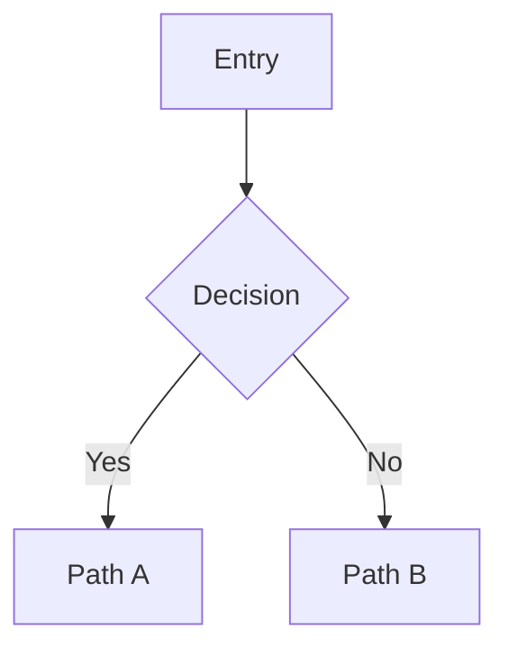

# 🧭 <ชื่อโปรเจค>

## 📊 Project Brief

| Field | Value |
|-------|-------|
| Product | ... |
| Phase | ... |
| Platform | Web responsive / iOS / Android |
| Business goal | ... |
| Success metric | ... |
| Deadline | ... |

---

## 👤 User Persona

**Primary persona:** <ชื่อ>

| Field | Value |
|-------|-------|
| Age | ... |
| Role | ... |
| Tech-savvy | ⭐⭐⭐⭐ |
| Goal | ... |
| Pain points | ... |
| Behavior | ... |
| Quote | "..." |

---

## 🎯 Jobs-To-Be-Done

> When **[situation]**, I want to **[motivation]**, so I can **[outcome]**.

**Hypothesis:** We believe [persona] needs [feature] because [insight]. We'll know this is true when [metric].

---

## 🗂️ Information Architecture

### Sitemap
```
Home
├── ...
├── ...
└── ...
```

### Navigation pattern
- Pattern: <top / side / tab / hamburger>
- Rationale: ...

---

## 🔄 User Flow



**Edge cases:**
- Empty state: ...
- Error state: ...
- Loading state: ...

---

## 📐 Wireframe

### Screen 1: <ชื่อ>
```
┌──────────────────┐
│  [ASCII layout]  │
└──────────────────┘
```

**Spec:**
- Layout: 12-col grid, 24px gutter
- Spacing token: 4/8/16/24/32
- Components: Header, Hero, CTA Button, Input
- States: empty / loading / default / error / success

### Screen 2: <ชื่อ>
...

---

## 🧪 Prototype Interaction

| Element | Trigger | Animation | Duration |
|---------|---------|-----------|----------|
| CTA Button | tap | shrink 0.96 + haptic | 150ms ease-out |
| Modal | tap close | slide down + fade | 200ms ease-in |
| Toast | success | slide from top | 300ms spring |

**Microinteractions:**
- Skeleton loading
- Pull-to-refresh
- Success checkmark animation

---

## ♿ Accessibility (WCAG 2.1 AA)

- [ ] Color contrast ≥ 4.5:1 (text), ≥ 3:1 (UI)
- [ ] Keyboard navigation working
- [ ] Focus ring visible
- [ ] Screen reader labels
- [ ] Touch target ≥ 44x44 pt
- [ ] Captions/alt text on images

---

## 👥 Usability Test Plan

**Method:** moderated remote (Zoom + Figma prototype)
**Participants:** 5-8 users matching persona
**Duration:** 30-45 min/session

### Tasks
1. ...
2. ...
3. ...
4. ...
5. ...

### Success Metrics
| Metric | Target |
|--------|--------|
| Completion rate | ≥ 80% |
| Time-on-task (median) | < X min |
| Error rate | < 2/task |
| SUS score | ≥ 70 |

### Post-test Questions
- ความยากระดับ 1-10?
- มีอะไรงง / ไม่ตามคาด?
- จะปรับอะไร?

---

## ✅ Deliverable Checklist

- [ ] Persona card (PDF)
- [ ] Sitemap (Whimsical / FigJam)
- [ ] User flow (Mermaid / FigJam)
- [ ] Wireframe Figma file (ทุก screen + states)
- [ ] Interactive prototype (Figma)
- [ ] Test plan + script
- [ ] Hand-off spec for dev (Zeplin / Figma Dev mode)

---

## 🔄 Next Steps

1. Internal review with PM + Dev
2. Recruit 5 test participants
3. Run usability test
4. Iterate based on feedback
5. Hand-off to dev with Figma Dev mode

---

*Generated by /ux-designer — Claude Skill Unlock v1.1*
