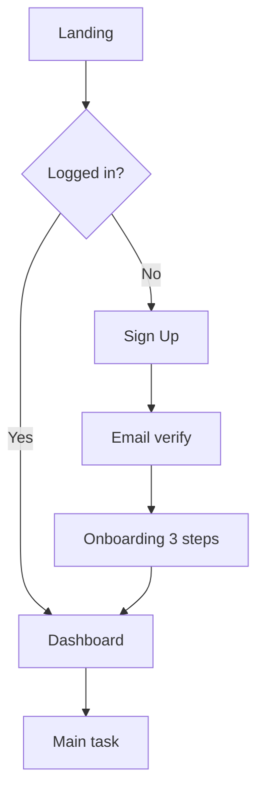

# UX Design Patterns & Wireframe Formulas

> Reference สำหรับออกแบบ flow, IA, wireframe ที่ตรงตามมาตรฐาน 2026

---

## Discovery Frameworks

### Jobs-To-Be-Done (JTBD)
```
When [situation],
I want to [motivation],
so I can [expected outcome].
```
**Example:** "When I'm rushing in the morning, I want to order coffee in advance, so I can grab it without queueing."

### Persona Card Template
```
Name: ฟ้า (Fa) — 28 ปี
Role: Marketing Manager
Tech-savvy: ⭐⭐⭐⭐ (4/5)
Goal: ทำงานเสร็จเร็ว มีเวลาให้ครอบครัว
Pain: เครื่องมือเยอะเกิน — สลับ tab ทั้งวัน
Behavior: ใช้มือถือ 80%, ไม่ชอบ pop-up
Quote: "ฉันต้องการเครื่องมือเดียวที่ทำได้ทุกอย่าง"
```

### 5 Whys (เจาะ root cause)
1. ทำไม user ไม่ใช้ feature X? → ไม่รู้ว่ามี
2. ทำไมไม่รู้? → ไม่มีใน onboarding
3. ทำไมไม่อยู่ใน onboarding? → ไม่เข้า MVP scope
4. ทำไมไม่เข้า MVP? → คิดว่าไม่สำคัญ
5. ทำไมคิดว่าไม่สำคัญ? → ไม่ได้สัมภาษณ์ user → **root cause: lack of user research**

---

## IA Patterns

### Sitemap (tree)
```
Home
├── Shop
│   ├── New Arrivals
│   ├── Categories
│   │   ├── Men
│   │   ├── Women
│   │   └── Kids
│   └── Sale
├── About
├── Blog
└── Account
    ├── Orders
    ├── Wishlist
    └── Settings
```

### Navigation Pattern Decision
| Pattern | Use when |
|---------|----------|
| Top nav | Desktop, < 7 items |
| Side nav | SaaS dashboard, 5-15 items |
| Tab bar | Mobile, 3-5 main sections |
| Hamburger | Mobile, > 5 items, secondary nav |
| Combined (top + side) | Complex SaaS |

### Card Sort Methods
- **Open sort:** user สร้าง category เอง → discovery
- **Closed sort:** user แบ่งของลง category ที่ตั้งไว้ → validation
- **Hybrid:** เริ่ม closed + เพิ่ม category ได้

---

## User Flow (Mermaid)



**Flow checklist:**
- [ ] Entry point ชัด
- [ ] Decision diamond มี yes/no
- [ ] Empty state วางแผนแล้ว
- [ ] Error state วางแผนแล้ว
- [ ] Success exit ชัด
- [ ] Abandon path มี recovery

---

## Wireframe ASCII (Low-fi)

### Mobile login screen
```
┌─────────────────┐
│  ←       Skip   │
├─────────────────┤
│                 │
│   [Logo]        │
│                 │
│   Welcome back  │
│   ──────────    │
│                 │
│  ┌───────────┐  │
│  │ Email     │  │
│  └───────────┘  │
│  ┌───────────┐  │
│  │ Password  │  │
│  └───────────┘  │
│                 │
│  [  Login   ]   │
│                 │
│  Forgot? · Sign │
└─────────────────┘
```

### Dashboard (desktop)
```
┌─────────────────────────────────────────┐
│ [Logo]   Home  Reports  Settings  [👤]  │
├──────┬──────────────────────────────────┤
│ Nav  │  📊 Today's Overview             │
│      │  ┌──────┐ ┌──────┐ ┌──────┐    │
│ - A  │  │ 1.2K │ │ ฿45K │ │ +12% │    │
│ - B  │  │ Users│ │ Sales│ │ Growth   │
│ - C  │  └──────┘ └──────┘ └──────┘    │
│      │                                   │
│      │  📈 Sales chart (12 weeks)       │
│      │  [chart placeholder]              │
└──────┴──────────────────────────────────┘
```

---

## State Coverage (สำคัญทุก screen!)

ทุก wireframe ต้องคิด 5 states:

1. **Empty** — ยังไม่มีข้อมูล (first-time user)
2. **Loading** — กำลังโหลด (skeleton, spinner)
3. **Default** — มีข้อมูลปกติ
4. **Error** — connection fail, validation error
5. **Success** — task complete, confirmation

---

## Spacing & Typography Tokens

### 8-pt Grid System
```
4 / 8 / 16 / 24 / 32 / 48 / 64 / 96
```

### Type scale (mobile)
| Role | Size | Line height |
|------|------|-------------|
| Display | 32 | 40 |
| H1 | 24 | 32 |
| H2 | 20 | 28 |
| H3 | 18 | 24 |
| Body | 16 | 24 |
| Small | 14 | 20 |
| Caption | 12 | 16 |

---

## Prototype Interaction Spec

```
Trigger: tap [Login] button
↓ ease-out 150ms — button shrink 0.96 (haptic feedback)
↓ ease-out 200ms — show loading spinner
↓ on success: smart-animate to Dashboard (300ms)
↓ on error: shake input + show toast (200ms ease-in-out)
```

### Animation Curves
- `ease-out` — UI element entering
- `ease-in` — UI element leaving
- `ease-in-out` — transitions
- `spring(damping: 15)` — playful, iOS-feel

---

## Usability Test Script

### Intro (5 นาที)
```
สวัสดีค่ะ ขอบคุณที่มาช่วยทดสอบ
- เราทดสอบ product ไม่ใช่ทดสอบคุณ
- ไม่มีคำตอบถูกผิด
- คิดอะไรพูดออกมาได้เลย (think-aloud)
- ทดสอบจะใช้เวลา 30-45 นาที
```

### Tasks (3-5 tasks)
```
Task 1: คุณอยากซื้อรองเท้าวิ่งคู่ใหม่ ลองใช้แอปนี้หา
Task 2: เพิ่มรองเท้าที่เลือกเข้าตะกร้า แล้วเช็คเอาท์
Task 3: หาคำสั่งซื้อล่าสุดของคุณ
```

### Post-task questions
- ระดับความยาก 1-10?
- มีอะไรที่งง / ไม่ตามที่คาด?
- ถ้าจะปรับ จะปรับอะไร?

### Metrics
- **Completion rate:** % task สำเร็จ (target 80%)
- **Time on task:** วัด median
- **Error count:** click ผิด, ย้อนกลับ
- **SUS score:** System Usability Scale (10 ข้อ, 0-100)

---

## Common UX Pitfalls (ห้าม)

❌ Dark patterns (force opt-in, hidden cost)
❌ Mystery meat navigation (icon ไม่มี label)
❌ Modal บน modal บน modal
❌ Carousel ที่ auto-rotate < 5 วิ
❌ Form > 8 fields ใน screen เดียว
❌ Infinite scroll ที่ไม่มี footer access
❌ Fonts < 14px บน mobile
❌ Color contrast < 4.5:1 (fail WCAG AA)
